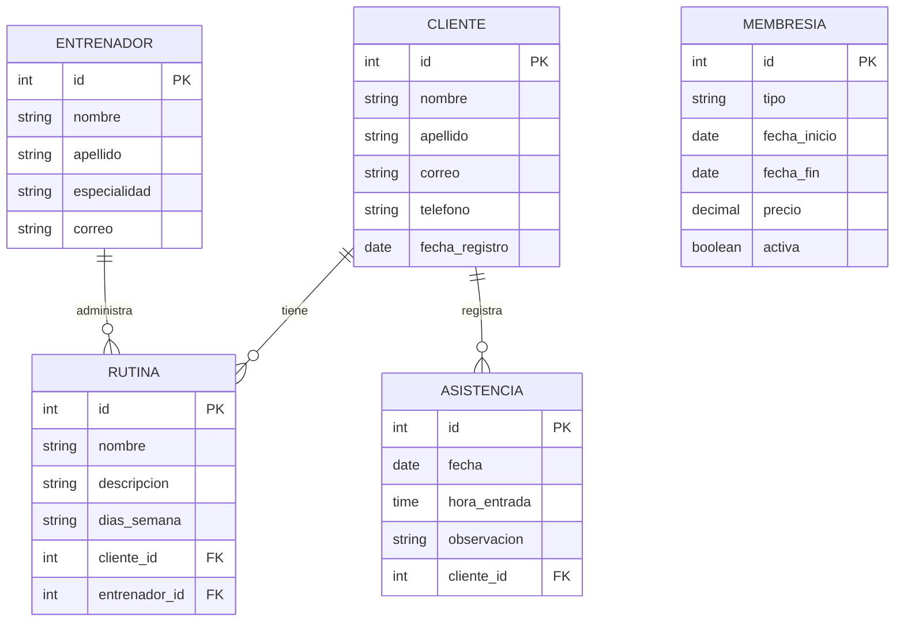

identificada# Investigación y desarrollo de una nueva solución persistente

# Sistema Web de Gestión de Gimnasio

---

# EJERCICIO 7 — Investigar una problemática real

## 7.1 Problemática identificada

En muchos gimnasios, la información de los clientes, entrenadores, membresías, rutinas y asistencias puede administrarse mediante registros manuales o archivos separados. Esto dificulta conocer rápidamente el estado de las membresías, controlar la asistencia de los clientes y mantener organizada la información relacionada con los entrenamientos.

El personal del gimnasio necesita una herramienta que permita centralizar esta información y facilitar las operaciones de registro, consulta, actualización y eliminación de datos.

Por este motivo, se propone desarrollar una **aplicación web para la gestión de un gimnasio**, utilizando Django, Django ORM y SQLite como sistema de almacenamiento persistente.

La aplicación permitirá administrar clientes, entrenadores, membresías, rutinas y asistencias desde una interfaz web.

## 7.2 Usuarios involucrados

Los principales usuarios del sistema serán:

* **Administrador:** administra toda la información del gimnasio.
* **Personal del gimnasio:** registra clientes, membresías y asistencias.
* **Entrenadores:** consultan y administran las rutinas asignadas a los clientes.
* **Clientes:** pueden consultar información relacionada con sus rutinas y membresía.

## 7.3 Proceso que se desea mejorar

El proceso actual puede presentar dificultades cuando los registros se realizan manualmente.

La solución propuesta permitirá centralizar la información:

```text
Usuario
   ↓
Aplicación Web
   ↓
Django
   ↓
Django ORM
   ↓
SQLite
   ↓
Información persistente
```

De esta manera, el personal podrá registrar y consultar información de forma rápida y organizada.

## 7.4 Objetivo

Desarrollar una aplicación web empresarial utilizando Django que permita administrar la información de un gimnasio mediante una base de datos persistente y operaciones CRUD.

La aplicación deberá permitir:

* Registrar clientes.
* Registrar entrenadores.
* Administrar membresías.
* Registrar rutinas.
* Registrar asistencias.
* Consultar información.
* Actualizar registros.
* Eliminar registros.

---

# EJERCICIO 8 — Definir los requisitos funcionales

| Código | Requisito funcional                                                                     |
| ------ | --------------------------------------------------------------------------------------- |
| RF01   | El sistema debe permitir registrar nuevos clientes.                                     |
| RF02   | El sistema debe permitir listar los clientes registrados.                               |
| RF03   | El sistema debe permitir actualizar la información de un cliente.                       |
| RF04   | El sistema debe permitir eliminar clientes registrados.                                 |
| RF05   | El sistema debe permitir registrar entrenadores.                                        |
| RF06   | El sistema debe permitir listar y administrar entrenadores.                             |
| RF07   | El sistema debe permitir registrar membresías para los clientes.                        |
| RF08   | El sistema debe permitir registrar rutinas asociadas a clientes y entrenadores.         |
| RF09   | El sistema debe permitir registrar la asistencia de los clientes.                       |
| RF10   | El sistema debe permitir consultar las asistencias registradas.                         |
| RF11   | El sistema debe permitir actualizar y eliminar rutinas.                                 |
| RF12   | El sistema debe permitir consultar información almacenada mediante Django ORM y SQLite. |

## Justificación

Los requisitos funcionales representan las principales necesidades del gimnasio.

Los requisitos RF01, RF03 y RF04 permiten demostrar las operaciones de **CREATE, UPDATE y DELETE** sobre los clientes.

Los requisitos RF02 y RF06 permiten realizar operaciones de **READ**.

Los requisitos RF07, RF08 y RF09 permiten trabajar con diferentes tipos de información y establecer relaciones entre las entidades.

---

# EJERCICIO 9 — Diseñar el modelo de datos

Se utilizarán cinco entidades principales:

1. Cliente
2. Entrenador
3. Membresia
4. Rutina
5. Asistencia

---

## 9.1 Entidad Cliente

| Campo          | Tipo de dato | Clave |
| -------------- | ------------ | ----- |
| id             | Integer      | PK    |
| nombre         | CharField    | —     |
| apellido       | CharField    | —     |
| correo         | EmailField   | —     |
| telefono       | CharField    | —     |
| fecha_registro | DateField    | —     |

### Justificación

La entidad **Cliente** representa a las personas que utilizan los servicios del gimnasio.

Es necesaria para identificar a cada persona, mantener sus datos y asociarla con rutinas, asistencias y membresías.

---

# 9.2 Entidad Entrenador

| Campo        | Tipo de dato | Clave |
| ------------ | ------------ | ----- |
| id           | Integer      | PK    |
| nombre       | CharField    | —     |
| apellido     | CharField    | —     |
| especialidad | CharField    | —     |
| correo       | EmailField   | —     |

### Justificación

La entidad **Entrenador** representa al personal encargado de orientar a los clientes en sus entrenamientos.

Permite almacenar la información del entrenador y asociarlo con las rutinas que administra.

---

# 9.3 Entidad Membresia

| Campo        | Tipo de dato | Clave |
| ------------ | ------------ | ----- |
| id           | Integer      | PK    |
| tipo         | CharField    | —     |
| fecha_inicio | DateField    | —     |
| fecha_fin    | DateField    | —     |
| precio       | DecimalField | —     |
| activa       | BooleanField | —     |

### Justificación

La entidad **Membresia** permite administrar los diferentes planes contratados en el gimnasio.

Permite conocer el tipo de membresía, su duración, precio y estado actual.

---

# 9.4 Entidad Rutina

| Campo       | Tipo de dato | Clave |
| ----------- | ------------ | ----- |
| id          | Integer      | PK    |
| nombre      | CharField    | —     |
| descripcion | TextField    | —     |
| dias_semana | CharField    | —     |
| cliente     | ForeignKey   | FK    |
| entrenador  | ForeignKey   | FK    |

### Justificación

La entidad **Rutina** representa el plan de entrenamiento asignado a un cliente.

La relación con `Cliente` permite conocer quién realiza la rutina.

La relación con `Entrenador` permite identificar qué entrenador creó o administra la rutina.

---

# 9.5 Entidad Asistencia

| Campo        | Tipo de dato | Clave |
| ------------ | ------------ | ----- |
| id           | Integer      | PK    |
| fecha        | DateField    | —     |
| hora_entrada | TimeField    | —     |
| observacion  | TextField    | —     |
| cliente      | ForeignKey   | FK    |

### Justificación

La entidad **Asistencia** permite registrar las visitas de los clientes al gimnasio.

La relación con `Cliente` permite saber qué persona asistió y en qué fecha.

---

# 9.6 Relaciones

Las relaciones principales serán:

```text
CLIENTE 1 ───────── N RUTINA
                     │
                     │ N
                     │
                     │ 1
                 ENTRENADOR
```

Además:

```text
CLIENTE 1 ───────── N ASISTENCIA
```

Esto representa que:

* Un cliente puede tener varias rutinas.
* Una rutina pertenece a un cliente.
* Un entrenador puede administrar varias rutinas.
* Una rutina pertenece a un entrenador.
* Un cliente puede tener múltiples registros de asistencia.
* Cada asistencia pertenece a un cliente.

---

# EJERCICIO 10 — Representar las relaciones

## 10.1 Diagrama del modelo



## 10.2 Justificación del diagrama

El diagrama representa las relaciones entre las entidades principales.

La relación entre `Cliente` y `Rutina` permite conocer las rutinas asignadas a cada cliente.

La relación entre `Entrenador` y `Rutina` permite identificar al entrenador responsable de cada rutina.

La relación entre `Cliente` y `Asistencia` permite registrar el historial de visitas de cada cliente.

La entidad `Membresia` permite almacenar la información relacionada con los planes ofrecidos por el gimnasio.

---

# EJERCICIO 11 — Crear la aplicación Django

Se creará una nueva aplicación Django llamada:

```text
gimnasio
```

La estructura esperada será:

```text
Semana 03/
│
├── .venv/
│
├── src/
│   ├── manage.py
│   │
│   ├── config/
│   │   ├── settings.py
│   │   ├── urls.py
│   │   ├── asgi.py
│   │   └── wsgi.py
│   │
│   └── gimnasio/
│       ├── migrations/
│       ├── templates/
│       ├── __init__.py
│       ├── admin.py
│       ├── apps.py
│       ├── models.py
│       ├── forms.py
│       ├── views.py
│       └── urls.py
│
├── requirements.txt
└── README.md
```

La aplicación debe registrarse en `INSTALLED_APPS`.

```python
INSTALLED_APPS = [
    'django.contrib.admin',
    'django.contrib.auth',
    'django.contrib.contenttypes',
    'django.contrib.sessions',
    'django.contrib.messages',
    'django.contrib.staticfiles',

    'gimnasio',
]
```

---

# EJERCICIO 12 — Implementar los Models

Los modelos deberán implementarse en:

```text
gimnasio/models.py
```

Ejemplo:

```python
from django.db import models


class Cliente(models.Model):
    nombre = models.CharField(max_length=100)
    apellido = models.CharField(max_length=100)
    correo = models.EmailField()
    telefono = models.CharField(max_length=20)
    fecha_registro = models.DateField()

    def __str__(self):
        return f"{self.nombre} {self.apellido}"


class Entrenador(models.Model):
    nombre = models.CharField(max_length=100)
    apellido = models.CharField(max_length=100)
    especialidad = models.CharField(max_length=100)
    correo = models.EmailField()

    def __str__(self):
        return f"{self.nombre} {self.apellido}"


class Membresia(models.Model):
    tipo = models.CharField(max_length=50)
    fecha_inicio = models.DateField()
    fecha_fin = models.DateField()
    precio = models.DecimalField(max_digits=8, decimal_places=2)
    activa = models.BooleanField(default=True)

    def __str__(self):
        return self.tipo


class Rutina(models.Model):
    nombre = models.CharField(max_length=100)
    descripcion = models.TextField()
    dias_semana = models.CharField(max_length=100)

    cliente = models.ForeignKey(
        Cliente,
        on_delete=models.CASCADE,
        related_name='rutinas'
    )

    entrenador = models.ForeignKey(
        Entrenador,
        on_delete=models.CASCADE,
        related_name='rutinas'
    )

    def __str__(self):
        return self.nombre


class Asistencia(models.Model):
    fecha = models.DateField()
    hora_entrada = models.TimeField()
    observacion = models.TextField(blank=True)

    cliente = models.ForeignKey(
        Cliente,
        on_delete=models.CASCADE,
        related_name='asistencias'
    )

    def __str__(self):
        return f"{self.cliente} - {self.fecha}"
```

Los modelos deberán registrarse también en:

```text
gimnasio/admin.py
```

---

# EJERCICIO 13 — Crear la base de datos mediante migraciones

Desde la carpeta donde se encuentra `manage.py`:

```bash
python manage.py makemigrations
```

Después:

```bash
python manage.py migrate
```

Finalmente:

```bash
python manage.py showmigrations
```

También se deberá comprobar el proyecto:

```bash
python manage.py check
```

## Evidencia

### Captura 13.1 — Migraciones

> INSERTAR AQUÍ CAPTURA DE LA TERMINAL MOSTRANDO `makemigrations`, `migrate` Y `showmigrations`.

**Explicación:**

Las migraciones permiten crear la estructura de la base de datos SQLite a partir de los modelos definidos en Django.

---

# EJERCICIO 14 — Implementar CREATE

La aplicación deberá permitir registrar nuevos datos mediante formularios.

Se deberá implementar CREATE para:

* Clientes.
* Entrenadores.
* Membresías.
* Rutinas.
* Asistencias.

Se recomienda utilizar `ModelForm`.

Flujo:

```text
Formulario
    ↓
POST
    ↓
View
    ↓
Django ORM
    ↓
INSERT
    ↓
SQLite
    ↓
redirect
    ↓
Listado
```

Después de guardar correctamente un registro, la aplicación debe redirigir al listado correspondiente.

## Evidencia

### Captura 14.1 — Registro de cliente

> INSERTAR AQUÍ CAPTURA DEL FORMULARIO.

### Captura 14.2 — Cliente registrado

> INSERTAR AQUÍ CAPTURA DEL LISTADO DESPUÉS DEL REGISTRO.

---

# EJERCICIO 15 — Implementar READ

Se deberán crear listados para:

* Clientes.
* Entrenadores.
* Membresías.
* Rutinas.
* Asistencias.

Los datos deben obtenerse utilizando Django ORM.

Ejemplos:

```python
Cliente.objects.all()
```

```python
Cliente.objects.order_by('apellido')
```

```python
Membresia.objects.filter(activa=True)
```

Los datos serán enviados desde las Views hacia Templates.

Flujo:

```text
SQLite
   ↓
Django ORM
   ↓
QuerySet
   ↓
View
   ↓
Template
   ↓
HTML
```

## Evidencia

### Captura 15.1 — Listado

> INSERTAR AQUÍ CAPTURA DE LOS REGISTROS OBTENIDOS DESDE SQLITE.

---

# EJERCICIO 16 — Implementar UPDATE

Cada registro deberá disponer de una opción para actualizar información.

Se deberá implementar UPDATE para las entidades principales.

El flujo será:

```text
Seleccionar registro
        ↓
GET
        ↓
Formulario con datos actuales
        ↓
POST
        ↓
Modificar objeto
        ↓
save()
        ↓
ORM
        ↓
UPDATE
        ↓
SQLite
        ↓
redirect
        ↓
Listado actualizado
```

Se deberá utilizar:

```python
get_object_or_404()
```

para recuperar registros.

## Evidencia

### Captura 16.1 — Formulario de edición

> INSERTAR AQUÍ CAPTURA DEL FORMULARIO CON LOS DATOS ACTUALES.

### Captura 16.2 — Registro actualizado

> INSERTAR AQUÍ CAPTURA DEL RESULTADO.

---

# EJERCICIO 17 — Implementar DELETE

Cada registro deberá disponer de una opción para eliminar información.

La eliminación deberá realizarse mediante `POST`.

No se debe eliminar información mediante GET.

Flujo:

```text
Seleccionar registro
        ↓
Confirmación
        ↓
POST
        ↓
delete()
        ↓
ORM
        ↓
DELETE
        ↓
SQLite
        ↓
redirect
        ↓
Listado actualizado
```

Se deberá mostrar una página de confirmación antes de eliminar.

## Evidencia

### Captura 17.1 — Confirmación

> INSERTAR AQUÍ CAPTURA DE LA PÁGINA DE CONFIRMACIÓN.

### Captura 17.2 — Eliminación realizada

> INSERTAR AQUÍ CAPTURA DEL LISTADO SIN EL REGISTRO ELIMINADO.

---

# CASOS DE PRUEBA

| Código | Operación | Acción                | Resultado esperado                                |
| ------ | --------- | --------------------- | ------------------------------------------------- |
| CP01   | CREATE    | Registrar cliente     | El cliente aparece en el listado.                 |
| CP02   | READ      | Consultar clientes    | Se muestran los clientes registrados.             |
| CP03   | UPDATE    | Modificar cliente     | Los datos aparecen actualizados.                  |
| CP04   | DELETE    | Eliminar cliente      | El cliente desaparece del listado.                |
| CP05   | CREATE    | Registrar entrenador  | El entrenador queda almacenado.                   |
| CP06   | CREATE    | Registrar membresía   | La membresía queda almacenada.                    |
| CP07   | CREATE    | Registrar rutina      | La rutina queda asociada al cliente y entrenador. |
| CP08   | READ      | Consultar rutinas     | Se muestran las rutinas registradas.              |
| CP09   | CREATE    | Registrar asistencia  | La asistencia queda asociada al cliente.          |
| CP10   | READ      | Consultar asistencias | Se muestran las asistencias registradas.          |
| CP11   | UPDATE    | Modificar rutina      | La rutina queda actualizada.                      |
| CP12   | DELETE    | Eliminar rutina       | La rutina desaparece del listado.                 |

---

# ESTRUCTURA DE LA APLICACIÓN

```text
gimnasio/
│
├── migrations/
│
├── templates/
│   └── gimnasio/
│       ├── base.html
│       ├── inicio.html
│       │
│       ├── clientes/
│       │   ├── lista.html
│       │   ├── formulario.html
│       │   └── confirmar_eliminar.html
│       │
│       ├── entrenadores/
│       │   ├── lista.html
│       │   ├── formulario.html
│       │   └── confirmar_eliminar.html
│       │
│       ├── membresias/
│       │   ├── lista.html
│       │   ├── formulario.html
│       │   └── confirmar_eliminar.html
│       │
│       ├── rutinas/
│       │   ├── lista.html
│       │   ├── formulario.html
│       │   └── confirmar_eliminar.html
│       │
│       └── asistencias/
│           ├── lista.html
│           ├── formulario.html
│           └── confirmar_eliminar.html
│
├── admin.py
├── apps.py
├── forms.py
├── models.py
├── urls.py
└── views.py
```

---

# URLS PRINCIPALES

```text
/
```

Página principal.

```text
/clientes/
/clientes/nuevo/
/clientes/<id>/editar/
/clientes/<id>/eliminar/

/entrenadores/
/entrenadores/nuevo/
/entrenadores/<id>/editar/
/entrenadores/<id>/eliminar/

/membresias/
/membresias/nuevo/
/membresias/<id>/editar/
/membresias/<id>/eliminar/

/rutinas/
/rutinas/nuevo/
/rutinas/<id>/editar/
/rutinas/<id>/eliminar/

/asistencias/
/asistencias/nuevo/
/asistencias/<id>/editar/
/asistencias/<id>/eliminar/
```

---

# INSTALACIÓN Y EJECUCIÓN

Activar el entorno virtual:

```powershell
.\.venv\Scripts\Activate.ps1
```

Instalar dependencias:

```powershell
pip install -r requirements.txt
```

Crear migraciones:

```powershell
python manage.py makemigrations
```

Aplicar migraciones:

```powershell
python manage.py migrate
```

Verificar:

```powershell
python manage.py check
```

Ejecutar el servidor:

```powershell
python manage.py runserver
```

La aplicación estará disponible en:

```text
http://127.0.0.1:8000/
```

---

# GITHUB

Verificar los cambios:

```powershell
git status
```

Agregar los archivos:

```powershell
git add .
```

Crear el commit:

```powershell
git commit -m "Implementar sistema de gestion de gimnasio"
```

Subir los cambios:

```powershell
git push
```

---

# TECNOLOGÍAS UTILIZADAS

* Python
* Django
* Django ORM
* SQLite
* HTML
* CSS
* JavaScript
* Visual Studio Code
* Git
* GitHub
* GitHub Copilot

---

# CONCLUSIONES

## Conclusión 1

El desarrollo del sistema web de gestión de gimnasio permitió aplicar los principales conceptos de Django para desarrollar una aplicación empresarial con persistencia de datos. La utilización de Models, ForeignKey, Django ORM y SQLite permite organizar la información y realizar operaciones CRUD de manera estructurada.

## Conclusión 2

La aplicación propuesta permite mejorar la administración de clientes, entrenadores, membresías, rutinas y asistencias. Además, las relaciones entre las entidades permiten representar situaciones reales del funcionamiento de un gimnasio y proporcionan una base que puede ampliarse posteriormente con nuevas funcionalidades.
